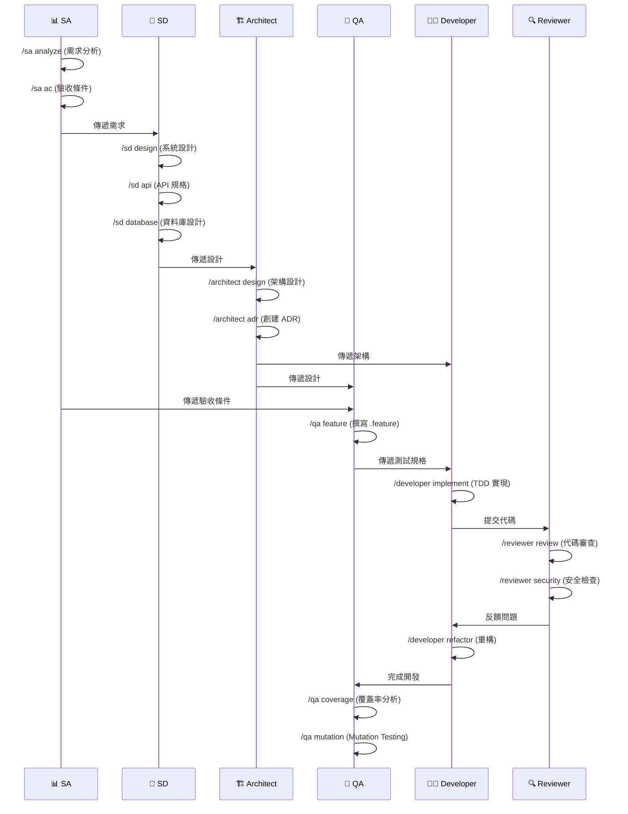

# 🚀 AI-SCRUM 角色系統使用指南

## 📖 目錄

1. [快速開始](#快速開始)
2. [角色系統概述](#角色系統概述)
3. [使用方式詳解](#使用方式詳解)
4. [實際使用範例](#實際使用範例)
5. [角色協作流程](#角色協作流程)
6. [最佳實踐](#最佳實踐)
7. [常見問題](#常見問題)

---

## 快速開始

### 第一次使用

```bash
# 1. 啟動 Claude Code
claude chat

# 2. 查看可用角色
/init

# 3. 選擇一個角色開始
/architect        # 查看架構師可用動作
/developer        # 查看開發員可用動作
/qa               # 查看 QA 可用動作
```

### 5 分鐘上手

```bash
# 情境：評估專案架構
/architect analyze
> AI 會自動掃描專案並生成架構分析報告

# 情境：實現新功能
/developer implement
> "實現客戶建立功能"

# 情境：撰寫測試
/qa feature
> "為客戶建立撰寫 .feature 檔案"

# 情境：代碼審查
/reviewer review
> "審查 CustomerService.java"
```

---

## 角色系統概述

### 設計理念

```
一個角色 = 一個指令集合 = 多個專業動作

範例:
  /architect (角色)
    ├── analyze (動作1: 架構分析)
    ├── design (動作2: 架構設計)
    ├── adr (動作3: ADR 記錄)
    └── review (動作4: 架構審查)
```

### 6 大角色

| 角色 | 指令 | 核心職責 | 主要產出 |
|------|------|----------|----------|
| 🏗️ 架構師 | `/architect` | 架構設計、技術選型 | 架構文檔、ADR、架構圖 |
| 👨‍💻 開發員 | `/developer` | 功能實現、代碼重構 | 程式碼、單元測試 |
| 🧪 QA測試員 | `/qa` | 測試撰寫、品質保證 | .feature、測試代碼 |
| 🔍 審查員 | `/reviewer` | 代碼審查、品質把關 | 審查報告、改進建議 |
| 📊 分析師 | `/sa` | 需求分析、驗收條件 | 需求文檔、User Story |
| 📐 設計師 | `/sd` | 系統設計、API規格 | 設計文檔、ERD、API規格 |

---

## 使用方式詳解

### 方式 1: 查看角色動作清單

```bash
# 執行角色命令，不帶任何參數
/architect

# AI 會顯示:
# 🏗️ 架構師指令集
# 可用動作:
#   1️⃣ 架構分析 - analyze
#   2️⃣ 架構設計 - design
#   3️⃣ ADR 記錄 - adr
#   ...
```

### 方式 2: 直接執行動作 (推薦)

```bash
# 格式: /角色 動作
/architect analyze      # 執行架構分析
/architect design       # 執行架構設計
/developer implement    # TDD 實現功能
/qa feature            # 撰寫 Feature
/reviewer review       # 代碼審查
```

### 方式 3: 自然語言描述

```bash
# 執行角色後，用自然語言描述需求
/architect
> "請分析這個專案的六角形架構實現"
> "幫我設計一個電商系統的微服務架構"
> "創建一個關於採用 CQRS 的 ADR"

/qa
> "為客戶管理功能撰寫 BDD 測試規格"
> "分析當前的測試覆蓋率並提供改進建議"
```

### 方式 4: 智能推斷 (最靈活)

```bash
# AI 會根據問題自動判斷應該使用哪個角色
"請評估專案架構"        → AI 以 architect 視角工作
"幫我重構這段代碼"      → AI 以 developer 視角工作
"檢查測試覆蓋率"        → AI 以 qa 視角工作
"審查這段代碼"          → AI 以 reviewer 視角工作
```

---

## 實際使用範例

### 範例 1: 新專案架構設計

```bash
# Step 1: 需求分析
/sa analyze
> "這是一個電商系統，需要支援商品管理、訂單處理、客戶管理"

# Output: 需求分析文檔 + 功能清單

# Step 2: 系統設計
/sd design
> "基於上述需求設計系統"

# Output: 系統設計文檔 + API 規格 + 資料庫設計

# Step 3: 架構設計
/architect design
> "採用微服務架構"

# Output: 架構設計文檔 + 架構圖 + ADR

# Step 4: 驗收條件
/sa ac
> "為商品管理定義驗收條件"

# Output: 驗收條件清單

# Step 5: BDD 測試
/qa feature
> "基於驗收條件撰寫 .feature"

# Output: .feature 檔案
```

### 範例 2: 功能開發

```bash
# Step 1: 撰寫測試 (TDD)
/qa feature
> "為客戶建立功能撰寫測試"

# Output: customer-creation.feature

# Step 2: 實現功能
/developer implement
> "實現客戶建立功能，遵循 TDD"

# Output:
# - CustomerController.java
# - CustomerService.java
# - CustomerRepository.java
# - 單元測試

# Step 3: 代碼審查
/reviewer review
> "審查 CustomerService"

# Output: 審查報告 + 改進建議

# Step 4: 重構改進
/developer refactor
> "根據審查建議重構 CustomerService"

# Output: 重構後的代碼
```

### 範例 3: 品質提升

```bash
# Step 1: 覆蓋率分析
/qa coverage
> "分析當前測試覆蓋率"

# Output:
# - 覆蓋率報告
# - 未覆蓋區域
# - 改進計畫

# Step 2: 補充測試
/qa unit-test
> "為 CustomerService 補充單元測試"

# Output: 測試代碼

# Step 3: Mutation Testing
/qa mutation
> "執行 Mutation Testing"

# Output: PITest 報告 + 弱測試識別

# Step 4: 安全檢查
/reviewer security
> "掃描安全漏洞"

# Output: 安全檢查報告
```

### 範例 4: 架構改進

```bash
# Step 1: 架構分析
/architect analyze
> "分析當前架構"

# Output:
# - 架構風格: 六角形架構
# - 評分: 8.5/10
# - 問題清單
# - 改進建議

# Step 2: 架構審查
/architect review
> "審查架構實現一致性"

# Output: 審查報告 + 不一致處

# Step 3: 創建 ADR
/architect adr
> "記錄重構為事件驅動架構的決策"

# Output: ADR-XXX-event-driven-refactoring.md

# Step 4: 架構圖
/architect diagram
> "生成重構後的架構圖"

# Output: Mermaid 架構圖
```

---

## 角色協作流程

### 完整開發流程



### SA-QA BDD 協作

```bash
# SA 定義驗收條件
/sa ac
> "為客戶建立功能定義驗收條件"

# Output:
AC1: 成功建立客戶
Given 使用者在客戶管理頁面
When 輸入有效資訊並點擊建立
Then 系統創建客戶並顯示成功訊息

# QA 基於 AC 撰寫 Feature
/qa feature
> "基於上述 AC 撰寫 .feature"

# Output: customer-creation.feature

# SA 審查 Feature
> 檢查 Feature 是否涵蓋所有 AC

# 迭代優化直到雙方確認
```

---

## 最佳實踐

### 1. 角色選擇原則

```yaml
任務類型與角色對應:
  架構相關: /architect
    - 評估架構
    - 設計架構
    - 技術選型
    - 記錄決策

  開發相關: /developer
    - 實現功能
    - 重構代碼
    - 修復 Bug
    - 效能優化

  測試相關: /qa
    - 撰寫測試
    - 分析覆蓋率
    - 品質保證

  審查相關: /reviewer
    - 代碼審查
    - 安全檢查
    - 規範檢查

  需求相關: /sa
    - 需求分析
    - 定義 AC
    - User Story

  設計相關: /sd
    - 系統設計
    - API 設計
    - 資料庫設計
```

### 2. 工作流建議

#### 新功能開發流程

```
1. /sa analyze          → 分析需求
2. /sa ac              → 定義驗收條件
3. /sd design          → 系統設計
4. /architect design   → 架構設計
5. /qa feature         → 撰寫 .feature
6. /developer implement → TDD 實現
7. /reviewer review    → 代碼審查
8. /qa coverage        → 覆蓋率檢查
```

#### Bug 修復流程

```
1. /developer debug    → 診斷問題
2. /qa unit-test       → 補充測試
3. /developer implement → 修復 Bug
4. /reviewer review    → 審查修復
5. /qa mutation        → 驗證測試品質
```

#### 架構改進流程

```
1. /architect analyze  → 架構分析
2. /architect review   → 架構審查
3. /architect adr      → 記錄決策
4. /developer refactor → 重構實現
5. /reviewer review    → 審查重構
```

### 3. 產出文檔管理

```bash
# ADR 存放位置
.ai-docs/adr/ADR-XXX-title.md

# Pattern 存放位置
.ai-docs/patterns/PATTERN-XXX-title.md

# Feature 存放位置
src/test/resources/features/

# 設計文檔存放位置
docs/design/

# 測試報告存放位置
target/site/jacoco/        # 覆蓋率
target/pit-reports/        # Mutation Testing
```

---

## 常見問題

### Q1: 如何知道該用哪個角色？

**A**: 看任務類型：
- 架構相關 → `/architect`
- 寫代碼 → `/developer`
- 寫測試 → `/qa`
- 審查代碼 → `/reviewer`
- 分析需求 → `/sa`
- 設計系統 → `/sd`

不確定就直接描述任務，AI 會自行判斷。

### Q2: 可以同時使用多個角色嗎？

**A**: 不建議。一個任務用一個角色，完成後再切換。
如果需要多個角色協作，按順序執行：

```bash
/sa analyze      # 先分析需求
/sd design       # 再設計系統
/developer implement  # 最後實現
```

### Q3: 角色指令與普通對話有什麼區別？

**A**:
- **角色指令**: AI 會以特定視角工作，產出符合角色規範
- **普通對話**: AI 以通用視角工作

範例：
```bash
# 使用角色
/architect analyze
→ 生成完整架構分析報告 (含架構圖、評分、建議)

# 普通對話
"分析架構"
→ 簡單文字說明
```

### Q4: 如何查看角色的所有動作？

**A**: 執行角色命令不帶參數：

```bash
/architect   # 顯示所有 architect 動作
/developer   # 顯示所有 developer 動作
/qa          # 顯示所有 qa 動作
```

或查看角色文檔：
```bash
cat .ai-docs/commands/architect.md
```

### Q5: 角色指令會自動執行嗎？

**A**: 會。執行 `/architect analyze` 後，AI 會：
1. 自動掃描專案結構
2. 分析架構風格
3. 評估設計原則
4. 生成完整報告

不需要額外指示。

### Q6: 如何自訂角色？

**A**: 編輯角色文件：

```bash
# 編輯架構師角色
vim .ai-docs/commands/architect.md

# 添加新動作
### 7️⃣ 自訂動作 - `custom`
**用途**: ...
**產出**: ...
```

### Q7: 忘記指令怎麼辦？

**A**: 隨時執行 `/init` 查看所有角色和常用命令。

---

## 進階技巧

### 技巧 1: 串連多個動作

```bash
# 完整的 Feature 開發流程
/sa ac           # 定義驗收條件
→ 將輸出傳遞給 QA

/qa feature      # 基於 AC 撰寫 Feature
→ 將 Feature 傳遞給 Developer

/developer implement  # 實現 Step Definitions
```

### 技巧 2: 使用上下文

```bash
# 第一步
/architect analyze
→ AI 分析並指出問題

# 第二步 (接續上下文)
/developer refactor
> "根據上面的分析重構 CustomerService"
→ AI 會參考前面的分析結果
```

### 技巧 3: 批量處理

```bash
# 批量分析多個類別
/reviewer review
> "審查所有 Service 類別"

# 批量生成測試
/qa unit-test
> "為所有 Service 生成單元測試"
```

---

## 參考資源

### 角色定義文檔

- `.ai-docs/commands/init.md` - 角色系統入口
- `.ai-docs/commands/architect.md` - 架構師指令集
- `.ai-docs/commands/developer.md` - 開發員指令集
- `.ai-docs/commands/qa.md` - QA 測試員指令集
- `.ai-docs/commands/reviewer.md` - 代碼審查員指令集
- `.ai-docs/commands/sa.md` - 系統分析師指令集
- `.ai-docs/commands/sd.md` - 系統設計師指令集

### 標準與規範

- `.ai-docs/standards/code-review-standards.md` - 代碼審查標準
- `.ai-docs/standards/qa-testing-standards.md` - 測試標準
- `.ai-docs/standards/developer-guide-standards.md` - 開發指南標準
- `.ai-docs/standards/mutation-testing-standards.md` - Mutation Testing 標準
- `.ai-docs/standards/contract-testing-standards.md` - Contract Testing 標準
- `.ai-docs/standards/develop-guide-doc-generator-standards.md` - 文檔生成器標準

### 架構決策記錄 (ADR)

- `.ai-docs/adr/ADR-TEMPLATE.md` - ADR 基礎模板
- `.ai-docs/adr/ADR-TEMPLATE-event-sourcing.md` - Event Sourcing 決策模板
- `.ai-docs/adr/ADR-TEMPLATE-knowledge-graph.md` - Knowledge Graph 決策模板
- `.ai-docs/adr/ADR-001-architecture-decision-records.md` - ADR 系統範例
- `.ai-docs/adr/ADR-002-mutation-testing-strategy.md` - Mutation 測試策略範例

### Pattern Library

- `.ai-docs/patterns/pattern-library-index.md` - Pattern Library 框架和指南
- `.ai-docs/patterns/PATTERN-TEMPLATE.md` - 模式文件模板

> **提示**：Pattern Library 採用「按需建立」原則。具體模式文件應根據專案實際需求創建，而非預先建立所有可能的模式。

### 專案資訊

- `.ai-docs/project-info/PROJECT-OVERVIEW.md` - 專案概覽
- `.ai-docs/project-info/WORKFLOW-GUIDE.md` - 工作流程指南
- `.ai-docs/project-info/PROJECT-ARCHITECTURE.md` - 專案架構設計

### 系統初始化

- `CLAUDE.md` - 角色系統初始化指南
- `.ai-docs/COMMAND-GUIDE.md` - 本文件（完整使用指南）
- `.ai-docs/memory_management.md` - AI 記憶管理協議

### 專案說明

- `README.md` - 專案說明

---

## 結語

角色系統將每個角色轉化為**可執行的指令集合**，讓您能夠：

- ✅ **明確職責** - 每個角色專注於特定領域
- ✅ **標準化產出** - 每個動作都有明確的產出規範
- ✅ **高效協作** - 角色間清晰的工作流程
- ✅ **知識累積** - 系統化的文檔與決策記錄

立即開始使用：`/init`

---

## 📚 文檔架構說明

本專案的文檔架構分為 5 個層級：

```
Layer 0: 系統初始化
  ├── CLAUDE.md - 角色系統初始化指南
  ├── COMMAND-GUIDE.md - 完整使用指南
  └── memory_management.md - AI 記憶管理協議

Layer 1: 技術基礎配置
  └── tech-stacks.md - 技術棧配置

Layer 2: 角色指令系統
  └── commands/ - 6 個角色的指令集合

Layer 3: 知識管理體系
  ├── standards/ - 品質標準
  ├── patterns/ - Pattern Library
  └── adr/ - 架構決策記錄

Layer 4: 專案資訊
  └── project-info/ - 專案概覽、流程指南、架構設計
```

每個層級都有明確的職責和用途，形成完整的知識管理體系。

**Layer 0（系統初始化）** 包含系統啟動和 AI 協作所需的核心文件，是整個系統的起點。

---

**🚀 透過系統化的角色指令集合，實現智能化軟體工程！**
