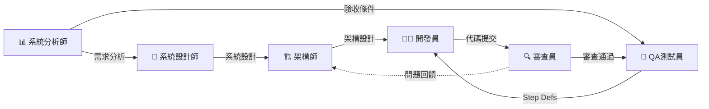

# 🚀 角色系統

提供 6 個專業技術角色，每個角色都是一個強大的**指令集合**。

---

## 🎭 可用角色

### 1️⃣ 🏗️ 架構師 (Architect)
**命令**: `/architect`
**專長**: 系統架構設計、技術選型、ADR

**核心動作**:
- `analyze` - 架構分析
- `design` - 架構設計
- `adr` - 創建架構決策記錄
- `review` - 架構審查
- `diagram` - 生成架構圖
- `tech-select` - 技術選型

**使用場景**:
- 評估現有架構
- 設計新系統架構
- 記錄重要技術決策
- 審查架構實現

---

### 2️⃣ 👨‍💻 開發員 (Developer)
**命令**: `/developer`
**專長**: 功能實現、代碼重構、問題診斷

**核心動作**:
- `implement` - TDD 功能實現
- `refactor` - 代碼重構
- `debug` - 問題診斷
- `optimize` - 效能優化
- `doc` - 代碼文檔

**使用場景**:
- 實現新功能
- 重構遺留代碼
- 修復 Bug
- 效能調優

---

### 3️⃣ 🧪 QA 測試員 (QA Tester)
**命令**: `/qa`
**專長**: BDD 測試、覆蓋率分析、品質保證

**核心動作**:
- `feature` - 撰寫 BDD Feature
- `coverage` - 覆蓋率分析
- `unit-test` - 單元測試
- `mutation` - Mutation Testing
- `plan` - 測試計畫
- `integration` - 整合測試

**使用場景**:
- 撰寫 Gherkin 測試規格
- 分析測試覆蓋率
- 補充單元測試
- 執行變異測試

---

### 4️⃣ 🔍 代碼審查員 (Code Reviewer)
**命令**: `/reviewer`
**專長**: 代碼審查、安全檢查、品質把關

**核心動作**:
- `review` - 代碼審查
- `security` - 安全檢查
- `performance` - 效能檢查
- `standards` - 規範檢查
- `suggest` - 改進建議

**使用場景**:
- Pull Request 審查
- 安全漏洞掃描
- 效能問題識別
- 代碼規範檢查

---

### 5️⃣ 📊 系統分析師 (System Analyst)
**命令**: `/sa`
**專長**: 需求分析、驗收條件、User Story

**核心動作**:
- `analyze` - 需求分析
- `ac` - 定義驗收條件
- `user-story` - 撰寫 User Story
- `flow` - 業務流程圖
- `validate` - 需求驗證

**使用場景**:
- 分析業務需求
- 定義驗收標準
- 撰寫用戶故事
- 繪製業務流程

---

### 6️⃣ 📐 系統設計師 (System Designer)
**命令**: `/sd`
**專長**: 系統設計、API 規格、資料庫設計

**核心動作**:
- `design` - 系統設計
- `api` - API 規格
- `database` - 資料庫設計
- `erd` - ERD 圖
- `sequence` - 序列圖

**使用場景**:
- 設計系統架構
- 定義 API 規格
- 設計資料庫結構
- 繪製設計圖表

---

## 💡 使用方式

### 方式 1: 直接執行角色 (查看動作清單)
```bash
/architect        # 進入架構師模式，查看可用動作
/developer        # 進入開發員模式
/qa               # 進入 QA 模式
```

### 方式 2: 子命令 (直接執行動作)
```bash
/architect analyze     # 執行架構分析
/developer implement   # TDD 實現功能
/qa feature           # 撰寫 BDD Feature
/reviewer review      # 代碼審查
/sa analyze          # 需求分析
/sd design           # 系統設計
```

### 方式 3: 自然語言 (最靈活)
```bash
# 執行角色命令後，用自然語言描述需求
/architect
> "請分析這個專案的架構設計"

/qa
> "為客戶建立功能撰寫 .feature 檔案"
```

---

## 🔗 角色協作流程



**典型工作流**:
1. **SA** 分析需求 → 定義驗收條件
2. **SD** 設計系統 → 定義 API 和資料庫
3. **Architect** 設計架構 → 創建 ADR
4. **QA** 撰寫 .feature → 定義測試規格
5. **Developer** 實現功能 → TDD 開發
6. **Reviewer** 審查代碼 → 品質把關
7. **QA** 執行測試 → 驗證功能

---

## 📚 完整文檔

### 專案資訊
- **專案概覽**: `.ai-docs/project-info/PROJECT-OVERVIEW.md`
- **專案架構**: `.ai-docs/project-info/PROJECT-ARCHITECTURE.md`
- **工作流程**: `.ai-docs/project-info/WORKFLOW-GUIDE.md`
- **重構日誌**: `.ai-docs/CHANGELOG-REFACTORING.md`
- **完整指南**: `../../CLAUDE.md`

### 知識資產
- **ADR 索引**: `.ai-docs/adr/README.md`
  - `ADR-001-stateless-battle-service.md` - 無狀態戰鬥服務設計
  - `ADR-002-equipment-type-system.md` - 類型安全的裝備系統
- **技術棧**: `.ai-docs/tech-stacks.md`
- **品質標準**: `.ai-docs/standards/`
  - `qa-testing-standards.md`
  - `code-review-standards.md`
  - `developer-guide-standards.md`
  - `mutation-testing-standards.md`
  - `contract-testing-standards.md`
- **設計模式**: `.ai-docs/patterns/pattern-library-index.md`

---

## 🎯 快速開始

### 新手推薦流程

1. **先了解專案**: `/architect analyze`
2. **查看需求**: `/sa analyze`
3. **撰寫測試**: `/qa feature`
4. **實現功能**: `/developer implement`
5. **代碼審查**: `/reviewer review`

### 常用命令速查

| 任務 | 命令 |
|------|------|
| 架構評估 | `/architect analyze` |
| 創建 ADR | `/architect adr` |
| 實現功能 | `/developer implement` |
| 重構代碼 | `/developer refactor` |
| 撰寫測試 | `/qa feature` |
| 分析覆蓋率 | `/qa coverage` |
| 代碼審查 | `/reviewer review` |
| 需求分析 | `/sa analyze` |
| 系統設計 | `/sd design` |
| API 設計 | `/sd api` |

---

## 💬 幫助與支援

- **查看此說明**: `/init`
- **專案文檔**: 閱讀 `README.md`
- **完整指南**: 閱讀 `CLAUDE.md`
- **使用說明**: 閱讀 `.ai-docs/COMMAND-GUIDE.md`

---

**選擇一個角色開始工作，或直接描述您的需求！**
