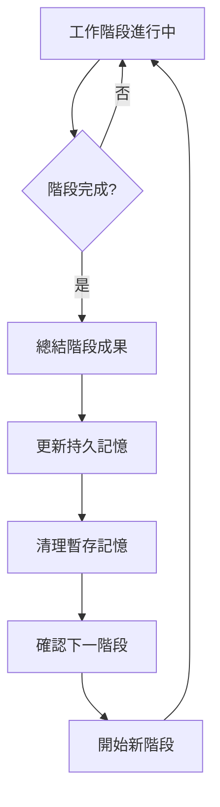

# 🧠 Context 分層記憶管理系統

## 系統概述

本文件定義了 AI 助手的記憶管理協議，實現智能的 context 分層管理，避免記憶過載並保持工作連續性。

## 📋 記憶分層架構

### 🔒 持久記憶區 (PERSISTENT_MEMORY)
**定義**: 必須在整個專案週期中保持的核心資訊
**保留原則**: 除非專案結束或明確要求，否則永不清理

```yaml
persistent_memory:
  project_core:
    name: "專案名稱和基本描述"
    tech_stack: "核心技術棧"
    architecture: "系統架構要點"
    
  standards_and_rules:
    documentation: "文件標準和規範"
    coding: "程式碼規範和最佳實踐"
    quality: "品質要求和驗收標準"
    
  progress_tracking:
    completed_phases: "已完成的主要階段"
    current_objectives: "當前目標和待辦事項"
    important_decisions: "重要決策和變更"
    
  domain_knowledge:
    business_rules: "核心業務規則"
    constraints: "技術和業務約束"
    dependencies: "關鍵依賴關係"
```

### 🗑️ 暫存記憶區 (VOLATILE_MEMORY)
**定義**: 當前工作階段的詳細資訊，完成階段後可清理
**清理原則**: 階段完成後保留摘要，清理詳細內容

```yaml
volatile_memory:
  file_contents:
    - "具體檔案內容和程式碼片段"
    - "詳細的配置文件內容"
    
  operation_details:
    - "具體的操作步驟記錄"
    - "中間處理結果和臨時資料"
    - "詳細的錯誤訊息和除錯資訊"
    
  implementation_specifics:
    - "具體的程式碼實作細節"
    - "暫存變數和計算結果"
    - "單次任務的詳細操作記錄"
```

## 🔄 階段轉換協議

### 觸發條件
以下情況觸發記憶管理：
- 用戶明確說出階段轉換指令
- 完成一個主要工作階段
- Context 使用量接近上限
- 用戶詢問專案狀態或進度

### 轉換指令

| 指令 | 功能 | 範例 |
|------|------|------|
| `STAGE_COMPLETE` | 標記當前階段完成 | "STAGE_COMPLETE 文件重構" |
| `NEXT_PHASE: [任務]` | 清理並開始新階段 | "NEXT_PHASE: 建立測試案例" |
| `MEMORY_RESET` | 強制清理暫存記憶 | "MEMORY_RESET" |
| `MEMORY_STATUS` | 查看記憶狀態 | "MEMORY_STATUS" |
| `SAVE_PROGRESS` | 保存進度到持久記憶 | "SAVE_PROGRESS" |

### 自動轉換流程



## 📤 標準回應模板

### 階段完成回應
```markdown
📋 **階段完成摘要**
- 當前階段: [階段名稱]
- 主要成果: [成果列表]
- 完成時間: [時間]

💾 **持久記憶更新**
- 專案狀態: [狀態描述]
- 新增完成項: [完成項目]
- 更新標準: [如有標準更新]

🗑️ **暫存記憶清理**
- 檔案內容細節 ✅ 已清理
- 操作步驟記錄 ✅ 已清理  
- 暫存變數資料 ✅ 已清理

🎯 **準備下一階段**
- 建議下一步: [建議]
- 等待指示: [是/否]
```

### 記憶狀態查詢回應
```markdown
🧠 **當前記憶狀態**

**持久記憶摘要:**
- 專案: [專案資訊]
- 進度: [進度概況]
- 標準: [適用標準]

**暫存記憶使用:**
- 檔案內容: [X個檔案]
- 操作記錄: [X項操作]
- 預估大小: [大小]

**記憶健康度:** ✅ 良好 / ⚠️ 接近上限 / ❌ 需要清理
```

## ⚙️ 實作指引

### AI 助手行為準則

1. **主動監控**: 定期評估 context 使用量
2. **智能保留**: 自動識別哪些資訊屬於持久記憶
3. **優雅轉換**: 階段轉換時提供清晰的摘要
4. **用戶確認**: 重要記憶清理前先確認
5. **連續性保證**: 確保工作流程不被記憶管理中斷

### 記憶保留策略

**保留優先級 (高到低):**
1. 專案核心資訊和目標
2. 技術標準和業務規則  
3. 已完成工作的成果摘要
4. 當前階段的關鍵上下文
5. 詳細的實作內容（最先清理）

### 異常處理

- **記憶過載**: 自動觸發清理並通知用戶
- **關鍵資訊丟失**: 提供記憶恢復建議
- **階段混亂**: 重新確認專案狀態和目標

## 🧪 測試指令

您可以使用以下指令測試記憶管理系統：

```bash
# 測試記憶狀態查詢
MEMORY_STATUS

# 測試階段完成
STAGE_COMPLETE 當前測試階段

# 測試階段轉換  
NEXT_PHASE: 建立新功能模組

# 測試強制重置
MEMORY_RESET

# 測試進度保存
SAVE_PROGRESS
```

---

**注意**: 此記憶管理系統旨在提升工作效率，如有任何問題或建議，請隨時提出調整。