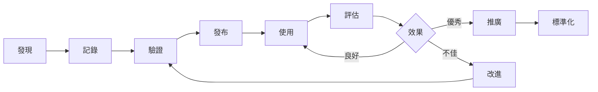
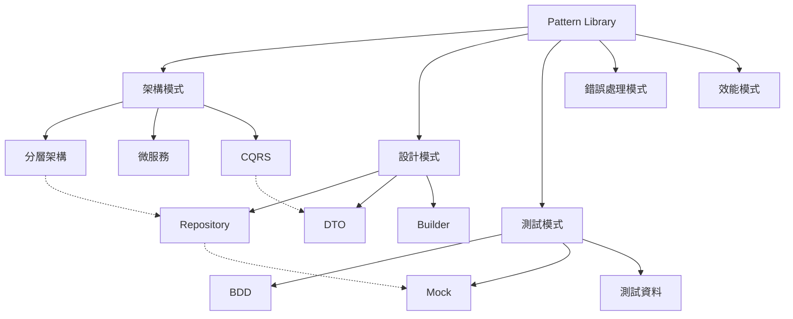
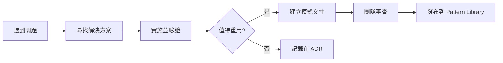

# 📚 Pattern Library 知識庫

## 🎯 系統概述

Pattern Library 是知識資產核心，系統化收集、分類和重用經過驗證的解決方案模式。

**重要提示**：此目錄作為 Pattern Library 的框架和指南。具體的模式文件應**根據專案實際需求創建**，而非預先建立所有可能的模式。

## 📊 模式分類體系

Pattern Library 支援以下模式分類：

### 架構模式 (Architectural Patterns)
適用於系統層級的架構設計決策。

**命名規則**：`ARCH-NNN-pattern-name.md`

**範例**：
- 分層架構模式
- 微服務邊界劃分
- CQRS 實現模式
- Event-Driven 整合

> **註**：專案特定的架構文件請放在 [專案資訊](./../project-info/PROJECT-ARCHITECTURE.md)

### 設計模式 (Design Patterns)
適用於程式碼層級的設計解決方案。

**命名規則**：`DES-NNN-pattern-name.md`

**範例**：
- Repository 模式實現
- DTO 與 Entity 轉換
- Builder 模式應用
- 策略模式實現

### 測試模式 (Testing Patterns)
適用於測試策略和測試程式碼組織。

**命名規則**：`TEST-NNN-pattern-name.md`

**範例**：
- BDD 測試結構
- Mock 策略選擇
- 測試資料建構
- 整合測試隔離

### 錯誤處理模式 (Error Handling Patterns)
適用於異常處理和錯誤恢復策略。

**命名規則**：`ERR-NNN-pattern-name.md`

**範例**：
- 全域異常處理
- 錯誤碼設計
- 重試機制
- 斷路器模式

### 效能模式 (Performance Patterns)
適用於效能優化和擴展性設計。

**命名規則**：`PERF-NNN-pattern-name.md`

**範例**：
- 快取策略
- 資料庫查詢優化
- 非同步處理
- 批次處理

## 🔍 模式結構模板

```yaml
pattern_template:
  id: "CATEGORY-NNN"
  name: "模式名稱"
  category: "分類"
  tags: ["標籤1", "標籤2"]

  context:
    problem: "問題描述"
    forces: ["影響因素1", "影響因素2"]

  solution:
    description: "解決方案描述"
    structure: "結構說明"
    implementation: "實現方式"

  code_example:
    language: "java"
    snippet: "程式碼範例"

  consequences:
    benefits: ["優點1", "優點2"]
    liabilities: ["缺點1", "缺點2"]

  related_patterns: ["相關模式1", "相關模式2"]

  usage_statistics:
    frequency: "使用頻率"
    success_rate: "成功率"
    last_used: "最後使用時間"
```

## 📈 使用統計

### 統計指標說明

每個模式文件應包含以下使用統計：

| 指標 | 說明 | 目標值 |
|------|------|--------|
| **成功率** | 應用此模式解決問題的成功比例 | > 85% |
| **使用頻率** | 在不同專案或場景中被引用的次數 | 視模式而定 |
| **平均實施時間** | 從開始到完成的平均時間 | 越短越好 |
| **維護成本** | 相對於初始實施的維護工作量 | < 30% |
| **效能影響** | 對系統效能的正面或負面影響 | 量化說明 |

### 追蹤方式

1. **手動記錄**：在模式文件中更新使用統計
2. **回顧會議**：定期審查模式的實際效果
3. **團隊回饋**：收集使用者的意見和建議

## 🔄 模式生命週期



## 🎯 搜尋與匹配

### 智能推薦引擎
```python
class PatternRecommender:
    def recommend_patterns(self, context):
        """基於上下文推薦適合的模式"""

        # 1. 分析問題特徵
        features = self.extract_features(context)

        # 2. 搜尋相關模式
        candidates = self.search_patterns(features)

        # 3. 計算匹配度
        scored_patterns = []
        for pattern in candidates:
            score = self.calculate_match_score(pattern, features)
            scored_patterns.append((pattern, score))

        # 4. 排序並返回
        scored_patterns.sort(key=lambda x: x[1], reverse=True)
        return scored_patterns[:5]

    def calculate_match_score(self, pattern, features):
        """計算模式匹配分數"""
        score = 0.0

        # 問題相似度
        score += self.problem_similarity(pattern.problem, features.problem) * 0.4

        # 標籤匹配度
        score += self.tag_match_ratio(pattern.tags, features.tags) * 0.3

        # 歷史成功率
        score += pattern.success_rate * 0.2

        # 使用頻率
        score += min(pattern.usage_frequency / 100, 1.0) * 0.1

        return score
```

## 📊 品質指標

### 模式品質評估
```yaml
quality_metrics:
  effectiveness:
    description: "解決問題的有效性"
    measurement: "成功案例 / 總使用次數"
    threshold: "> 85%"

  reusability:
    description: "重用程度"
    measurement: "不同專案使用次數"
    threshold: "> 3"

  maintainability:
    description: "維護性"
    measurement: "平均修改次數"
    threshold: "< 2次/年"

  clarity:
    description: "清晰度"
    measurement: "理解時間"
    threshold: "< 10分鐘"

  performance_impact:
    description: "效能影響"
    measurement: "效能改善百分比"
    threshold: "> 20%"
```

## 🔗 知識關聯圖



## 🚀 使用指南

### 快速查找
1. **按類別瀏覽** - 使用分類索引
2. **關鍵字搜尋** - 使用標籤系統
3. **情境匹配** - 描述問題獲取推薦
4. **相關模式** - 查看關聯推薦

### 貢獻新模式
1. 使用模板創建模式文件
2. 提供完整的程式碼範例
3. 記錄使用場景和限制
4. 提交審查和驗證

### 模式評估
1. 追蹤使用統計
2. 收集回饋意見
3. 定期審查效果
4. 持續優化改進

## 📈 成效追蹤

### 建議追蹤的關鍵指標

- **模式數量**：當前維護的模式文件數量
- **使用率**：團隊成員查詢和引用的頻率
- **成功率**：應用模式後問題解決的比例
- **節省時間**：相對於從零開始的時間節省

### 投資回報計算範例

```yaml
roi_calculation:
  time_saved_per_use: "X 小時"
  average_uses_per_sprint: "Y 次"
  developer_hourly_cost: "$Z"

  sprint_savings: "計算節省的時間成本"
  annual_roi: "年度投資回報率"
```

**提示**：根據實際數據調整上述指標，避免使用虛構的數字。

## 🔮 Pattern Library 演進方向

### 按需建立原則

1. **實際需求驅動**：當專案遇到重複問題時才建立模式
2. **驗證後記錄**：模式需要經過實踐驗證才正式記錄
3. **持續優化**：根據使用回饋不斷改進模式內容
4. **知識分享**：透過模式文件促進團隊知識傳承

### 建議的建立流程



### 模式維護

- **定期審查**：每季度檢視現有模式的適用性
- **版本控制**：重大變更應建立新版本
- **淘汰機制**：移除過時或不再適用的模式