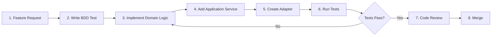

# Final Fantasy Game System - Workflow Guide

> Development workflow and best practices for the Final Fantasy Game System project

---

## 🎯 Overview

This guide provides practical workflows for developing, testing, and maintaining the Final Fantasy Game System using Hexagonal Architecture and modern Java development practices.

---

## 🔄 Development Workflow

### Standard Development Cycle



### Detailed Steps

#### 1. Feature Request
- Analyze requirements
- Identify affected layers (Domain, Application, Infrastructure)
- Check existing ADRs for relevant decisions

#### 2. Write BDD Test (Test-First Development)
```bash
# Create feature file in Traditional Chinese
vim finalfantasy-web/src/test/resources/features/your_feature.feature

# Example structure:
# Feature: 新功能名稱
#   Scenario: 測試場景
#     Given 前置條件
#     When 執行動作
#     Then 預期結果
```

#### 3. Implement Domain Logic
```bash
# Domain layer - pure business logic
# Location: finalfantasy-domain/src/main/java/net/game/finalfantasy/domain/

# Rules:
# - No framework dependencies
# - Only JDK + Lombok
# - Pure Java objects
# - Rich domain models
```

**Example**: Adding a new status effect
```java
// finalfantasy-domain/src/main/java/net/game/finalfantasy/domain/model/character/StatusEffect.java

public class StatusEffect {
    private final String name;
    private final int duration;
    private final EffectType type;

    // Pure domain logic, no framework annotations
}
```

#### 4. Add Application Service
```bash
# Application layer - use case orchestration
# Location: finalfantasy-application/src/main/java/net/game/finalfantasy/application/
```

**Rules**:
- Define ports (interfaces) in `port/in` and `port/out`
- Implement services that orchestrate domain logic
- Keep services stateless (see ADR-0001)
- Add comprehensive input validation

**Example**: BattleService method
```java
@Service
@RequiredArgsConstructor
public class BattleService {

    private final BattleRepository battleRepository;

    public void applyStatusEffect(String battleId, String characterName, StatusEffect effect) {
        // 1. Validate inputs
        Objects.requireNonNull(battleId, "Battle ID cannot be null");
        Objects.requireNonNull(characterName, "Character name cannot be null");
        Objects.requireNonNull(effect, "Status effect cannot be null");

        // 2. Get battle from repository
        Battle battle = battleRepository.findById(battleId)
            .orElseThrow(() -> new IllegalStateException("Battle not found: " + battleId));

        // 3. Domain logic
        FF6Character character = battle.findCharacter(characterName);
        character.applyStatusEffect(effect);

        // 4. Save state
        battleRepository.save(battle);
    }
}
```

#### 5. Create Adapter
```bash
# Infrastructure layer - technical implementation
# Location: finalfantasy-infrastructure/src/main/java/net/game/finalfantasy/infrastructure/adapter/
```

**Types of Adapters**:
- **Driving (in)**: Controllers, Vert.x servers, scheduled tasks
- **Driven (out)**: Repository implementations, event publishers, external services

**Example**: Repository adapter
```java
@Repository
public class InMemoryBattleRepository implements BattleRepository {

    private final Map<String, Battle> battles = new ConcurrentHashMap<>();

    @Override
    public void save(Battle battle) {
        Objects.requireNonNull(battle, "Battle cannot be null");
        Objects.requireNonNull(battle.getBattleId(), "Battle ID cannot be null");
        battles.put(battle.getBattleId(), battle);
    }

    @Override
    public Optional<Battle> findById(String battleId) {
        Objects.requireNonNull(battleId, "Battle ID cannot be null");
        return Optional.ofNullable(battles.get(battleId));
    }
}
```

#### 6. Run Tests
```bash
# Run all tests
mvn test

# Run specific test
mvn test -Dtest=BattleServiceTest

# Run BDD tests with specific tag
mvn test -Dcucumber.filter.tags="@battle"
```

#### 7. Code Review Checklist
- [ ] Dependency direction is correct (inward only)
- [ ] Domain layer has no framework dependencies
- [ ] Services are stateless
- [ ] Input validation is comprehensive
- [ ] All tests pass
- [ ] Code follows SOLID principles
- [ ] No magic strings or numbers
- [ ] Type safety is maintained

#### 8. Merge
```bash
# Ensure all tests pass
mvn clean test

# Check for uncommitted changes
git status

# Commit changes
git add .
git commit -m "feat: your feature description"

# Push to remote
git push origin your-branch
```

---

## 🏗️ Layer-Specific Guidelines

### Domain Layer (`finalfantasy-domain`)

**Purpose**: Pure business logic, framework-independent

**Rules**:
- ✅ Only JDK standard library + Lombok
- ❌ NO Spring annotations
- ❌ NO JPA annotations
- ❌ NO Jackson
- ❌ NO any framework

**Structure**:
```
domain/
├── model/              # Entities, Value Objects
│   ├── battle/        # Battle, Turn
│   ├── character/     # FF6Character, StatusEffect
│   ├── equipment/     # Equipment, EquipmentType
│   ├── hero/          # Hero (API model)
│   ├── magic/         # MagicSpell
│   └── stats/         # Stat models
└── service/           # Domain services
    ├── AtbCalculationService
    ├── DamageCalculationService
    └── MagicCalculationService
```

**Example Domain Model**:
```java
package net.game.finalfantasy.domain.model.battle;

import lombok.Getter;
import lombok.RequiredArgsConstructor;

@Getter
@RequiredArgsConstructor
public class Battle {
    private final String battleId;
    private final List<FF6Character> allies;
    private final List<FF6Character> enemies;
    private int turnCount;

    // Pure domain logic - no framework dependencies
    public void incrementTurn() {
        this.turnCount++;
    }
}
```

---

### Application Layer (`finalfantasy-application`)

**Purpose**: Use case orchestration, port definitions

**Rules**:
- ✅ Define interfaces (ports)
- ✅ Orchestrate domain logic
- ✅ Services should be stateless
- ✅ Comprehensive input validation
- ❌ NO direct database access
- ❌ NO HTTP/Web dependencies

**Structure**:
```
application/
├── port/
│   ├── in/                      # Use Case interfaces
│   │   ├── BattleUseCase
│   │   └── CharacterActionUseCase
│   └── out/                     # Repository interfaces
│       ├── BattleRepository
│       ├── CharacterRepository
│       └── GameEventPublisher
└── service/                     # Service implementations
    ├── BattleService           # Implements BattleUseCase
    └── CharacterActionService
```

**Best Practices**:
1. **Stateless Services** (see ADR-0001)
   - No instance variables for state
   - Use ThreadLocal for context if needed
   - Store state in domain objects + repository

2. **Input Validation**
   ```java
   public void startBattle(FF6Character[] allies, FF6Character[] enemies) {
       Objects.requireNonNull(allies, "Allies cannot be null");
       Objects.requireNonNull(enemies, "Enemies cannot be null");

       if (allies.length == 0) {
           throw new IllegalArgumentException("At least one ally is required");
       }

       // Business logic...
   }
   ```

3. **Transaction Management**
   ```java
   @Transactional  // Only in service layer
   public void processBattleTurn(String battleId) {
       // Atomic operation
   }
   ```

---

### Infrastructure Layer (`finalfantasy-infrastructure`)

**Purpose**: Technical implementation, adapter pattern

**Rules**:
- ✅ Implement ports from Application layer
- ✅ Use Spring/framework annotations
- ✅ Handle technical concerns (DB, HTTP, etc.)
- ✅ Configuration classes

**Structure**:
```
infrastructure/
├── adapter/
│   ├── in/                          # Driving Adapters
│   │   ├── vertx/
│   │   │   ├── HttpServerVerticle   # Vert.x HTTP (8081)
│   │   │   ├── SocketServerVerticle # WebSocket (8082)
│   │   │   └── VertxService
│   │   ├── web/
│   │   │   └── dto/                 # API DTOs
│   │   └── mapper/
│   │       └── HeroMapper           # DTO ↔ Domain mapping
│   ├── out/                         # Driven Adapters
│   │   ├── persistence/
│   │   │   ├── InMemoryBattleRepository
│   │   │   └── InMemoryCharacterRepository
│   │   └── event/
│   │       └── SimpleGameEventPublisher
│   └── config/                      # Configuration
│       ├── ServerPortsConfig
│       ├── SwaggerConfig
│       └── VertxConfig
```

**Adapter Examples**:

**Driving Adapter (REST Controller - Future)**:
```java
@RestController
@RequestMapping("/api/battles")
@RequiredArgsConstructor
public class BattleController {

    private final BattleUseCase battleUseCase;
    private final HeroMapper heroMapper;

    @PostMapping
    public ResponseEntity<BattleResponse> startBattle(@RequestBody StartBattleRequest request) {
        // Convert DTO → Domain
        FF6Character[] allies = request.getAllies().stream()
            .map(heroMapper::toFF6Character)
            .toArray(FF6Character[]::new);

        // Use case
        String battleId = battleUseCase.startBattle(allies, enemies);

        // Convert Domain → DTO
        return ResponseEntity.ok(new BattleResponse(battleId));
    }
}
```

**Driven Adapter (Repository)**:
```java
@Repository
public class InMemoryBattleRepository implements BattleRepository {
    private final Map<String, Battle> battles = new ConcurrentHashMap<>();

    @Override
    public void save(Battle battle) {
        Objects.requireNonNull(battle, "Battle cannot be null");
        battles.put(battle.getBattleId(), battle);
    }
}
```

---

## 🧪 Testing Workflow

### BDD Testing (Cucumber)

**Location**: `finalfantasy-web/src/test/resources/features/`

**Workflow**:
1. Write feature file in Traditional Chinese
2. Implement step definitions
3. Run tests
4. Iterate until green

**Feature File Template**:
```gherkin
# finalfantasy-web/src/test/resources/features/your_feature.feature

Feature: 功能名稱

  Scenario: 測試場景名稱
    Given 前置條件
    When 執行某個動作
    Then 應該得到預期結果

  Scenario Outline: 參數化測試
    Given 角色有 <hp> HP
    When 受到 <damage> 點傷害
    Then 剩餘 HP 為 <remaining>

    Examples:
      | hp  | damage | remaining |
      | 100 | 30     | 70        |
      | 50  | 50     | 0         |
```

**Step Definitions**:
```java
// finalfantasy-web/src/test/java/cucumber/domain/YourFeatureSteps.java

@Component
public class YourFeatureSteps {

    private FF6Character character;
    private int damage;

    @Given("角色有 {int} HP")
    public void 角色有HP(int hp) {
        character = new FF6Character("TestChar", 1, hp, 10, 10, 10);
    }

    @When("受到 {int} 點傷害")
    public void 受到點傷害(int damage) {
        this.damage = damage;
        character.takeDamage(damage);
    }

    @Then("剩餘 HP 為 {int}")
    public void 剩餘HP為(int expectedHp) {
        assertEquals(expectedHp, character.getHp());
    }
}
```

**Run BDD Tests**:
```bash
# All tests
mvn test

# Specific feature
mvn test -Dcucumber.filter.tags="@your_tag"

# Specific scenario
mvn test -Dcucumber.filter.name="測試場景名稱"
```

### Unit Testing

**Best Practices**:
```java
@Test
void testBattleServiceIsStateless() {
    // Given
    FF6Character[] allies = {createTestCharacter("Terra")};
    FF6Character[] enemies = {createTestCharacter("Soldier")};

    // When
    battleService.startBattle(allies, enemies);

    // Then
    Battle battle = battleRepository.findById(currentBattleId).orElseThrow();
    assertNotNull(battle);
    assertEquals(1, battle.getAllies().size());
}

@Test
void testEquipmentTypeDetection() {
    // Given
    Equipment weapon = Equipment.IRON_SWORD;

    // When & Then
    assertTrue(weapon.isWeapon());
    assertFalse(weapon.isRelic());
    assertEquals(EquipmentType.WEAPON, weapon.getType());
}
```

---

## 📊 Quality Assurance

### Code Quality Checklist

Before committing, verify:
- [ ] All tests pass (`mvn test`)
- [ ] No compiler warnings
- [ ] No magic strings/numbers
- [ ] Proper null checks
- [ ] Meaningful variable names
- [ ] SOLID principles followed
- [ ] Layer dependencies correct

### Dependency Rules Validation

```bash
# Check dependency tree
mvn dependency:tree

# Verify:
# - Domain depends on: NOTHING (only JDK)
# - Application depends on: Domain only
# - Infrastructure depends on: Domain + Application
# - Web depends on: All modules
```

### Test Coverage

```bash
# Generate coverage report
mvn clean test jacoco:report

# View report
open target/site/jacoco/index.html
```

---

## 🔧 Common Tasks

### Adding a New Domain Entity

```bash
# 1. Create entity in domain layer
vim finalfantasy-domain/src/main/java/net/game/finalfantasy/domain/model/your_entity/YourEntity.java

# 2. Add tests
vim finalfantasy-domain/src/test/java/net/game/finalfantasy/domain/model/your_entity/YourEntityTest.java

# 3. Run tests
mvn test -Dtest=YourEntityTest
```

### Adding a New Use Case

```bash
# 1. Define port interface
vim finalfantasy-application/src/main/java/net/game/finalfantasy/application/port/in/YourUseCase.java

# 2. Implement service
vim finalfantasy-application/src/main/java/net/game/finalfantasy/application/service/YourService.java

# 3. Add BDD test
vim finalfantasy-web/src/test/resources/features/your_feature.feature

# 4. Implement step definitions
vim finalfantasy-web/src/test/java/cucumber/domain/YourFeatureSteps.java

# 5. Run tests
mvn test
```

### Adding a New Adapter

```bash
# For driving adapter (e.g., REST controller):
vim finalfantasy-infrastructure/src/main/java/net/game/finalfantasy/infrastructure/adapter/in/web/YourController.java

# For driven adapter (e.g., repository):
vim finalfantasy-infrastructure/src/main/java/net/game/finalfantasy/infrastructure/adapter/out/persistence/YourRepository.java
```

### Creating an ADR

```bash
# 1. Copy template
cp .ai-docs/adr/ADR-TEMPLATE.md .ai-docs/adr/NNNN-your-decision.md

# 2. Fill in sections
vim .ai-docs/adr/NNNN-your-decision.md

# 3. Update index
vim .ai-docs/adr/README.md
```

---

## 🚀 Deployment Workflow

### Local Development

```bash
# Start application
mvn spring-boot:run

# Application runs on:
# - Spring Boot HTTP: http://localhost:8080
# - Vert.x HTTP: http://localhost:8081
# - Vert.x WebSocket: ws://localhost:8082
```

### Docker Deployment

```bash
# Start MySQL
docker-compose up -d

# Build JAR
mvn clean package -DskipTests

# Run application
java -jar finalfantasy-web/target/finalfantasy-web-1.0.0-SNAPSHOT.jar
```

---

## 📚 Reference Documentation

### Internal Documentation
- [Project Architecture](PROJECT-ARCHITECTURE.md)
- [Project Overview](PROJECT-OVERVIEW.md)
- [Technology Stack](../tech-stacks.md)
- [ADR Index](../adr/README.md)
- [Refactoring Changelog](../CHANGELOG-REFACTORING.md)

### External Resources
- [Hexagonal Architecture](https://alistair.cockburn.us/hexagonal-architecture/)
- [Domain-Driven Design](https://martinfowler.com/tags/domain%20driven%20design.html)
- [Spring Boot Reference](https://docs.spring.io/spring-boot/docs/3.5.3/reference/html/)
- [Cucumber Documentation](https://cucumber.io/docs/cucumber/)

---

## 💡 Pro Tips

### 1. Keep Domain Pure
Always ask: "Does this belong in the domain, or is it a technical concern?"
- Domain: Business rules, calculations, game mechanics
- Infrastructure: HTTP, database, JSON serialization

### 2. Test-First Development
Write the test before the implementation. This ensures:
- Clear requirements
- Testable design
- Better architecture

### 3. Use ADRs for Important Decisions
Document architectural decisions with ADRs:
- Why this approach?
- What alternatives were considered?
- What are the trade-offs?

### 4. Keep Services Stateless
See ADR-0001 for details:
- No instance variables for request state
- Use domain objects + repository for persistence
- ThreadLocal only for cross-cutting context

### 5. Type Safety Over String Matching
See ADR-0002 for details:
- Use enums instead of magic strings
- Compile-time checking is better than runtime
- Better IDE support and refactoring

---

**Maintained by**: Development Team
**Last Updated**: 2025-10-25
