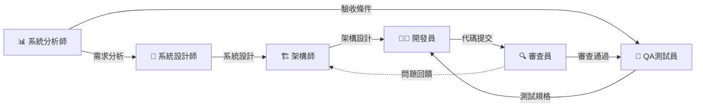

# 角色系統使用指南

## 🚀 快速開始

### 查看所有可用任務

```bash
/init
```

執行 `/init` 將顯示所有可用的專業角色和任務。

### 執行特定任務

```bash
# 方式 1: 直接執行任務
/architect analyze     # 執行架構分析
/developer implement   # TDD 實現功能
/qa feature           # 撰寫 BDD Feature

# 方式 2: 查看任務列表後選擇
/architect            # 顯示所有架構師相關任務
# 然後描述具體需求

# 方式 3: 自然語言描述
"請以架構師視角分析專案架構"
"使用 TDD 方式實現客戶建立功能"
```

---

## 🎭 6 大專業角色

| 角色 | 指令 | 核心職責 | 主要任務 |
|------|------|---------|---------|
| 🏗️ **架構師** | `/architect` | 架構設計、技術選型、ADR | analyze, design, adr, review, diagram, tech-select |
| 👨‍💻 **開發員** | `/developer` | 功能實現、重構、問題診斷 | implement, refactor, debug, optimize, doc |
| 🧪 **QA 測試員** | `/qa` | BDD 測試、覆蓋率分析、品質保證 | feature, coverage, unit-test, mutation, plan, integration |
| 🔍 **代碼審查員** | `/reviewer` | 代碼審查、安全檢查、品質把關 | review, security, performance, standards, suggest |
| 📊 **系統分析師** | `/sa` | 需求分析、驗收條件、User Story | analyze, ac, user-story, flow, validate |
| 📐 **系統設計師** | `/sd` | 系統設計、API 規格、資料庫設計 | design, api, database, erd, sequence |

### 角色任務定義

所有角色的詳細任務定義位於：`.ai-docs/commands/` 目錄

- `.ai-docs/commands/init.md` - 角色系統入口
- `.ai-docs/commands/architect.md` - 架構師任務集
- `.ai-docs/commands/developer.md` - 開發員任務集
- `.ai-docs/commands/qa.md` - QA 測試員任務集
- `.ai-docs/commands/reviewer.md` - 代碼審查員任務集
- `.ai-docs/commands/sa.md` - 系統分析師任務集
- `.ai-docs/commands/sd.md` - 系統設計師任務集

---

## 💡 使用方式說明

### SlashCommand 運作機制

當你執行 `/architect analyze` 時：
1. 系統載入 `.ai-docs/commands/architect.md` 作為 prompt
2. Claude Code 根據 prompt 中的 `analyze` 任務執行步驟進行操作
3. 執行對應的工具操作（Glob、Read、Grep、Edit、Write 等）
4. 生成符合任務定義的產出

### 任務執行方式

**方式 1: 直接執行特定任務（推薦）**
```bash
/architect analyze      # 立即執行架構分析
/developer implement    # 立即執行 TDD 實現
/qa coverage           # 立即執行覆蓋率分析
```

**方式 2: 查看任務後選擇**
```bash
/architect
# 顯示所有可用任務後，描述具體需求：
"請執行 analyze 任務"
```

**方式 3: 自然語言描述**
```bash
"請以架構師視角分析專案架構"
"使用 QA 測試員的方式分析測試覆蓋率"
```

### 任務間的上下文傳遞

**在同一對話中順序執行：**
```bash
# Step 1: 執行架構分析
/architect analyze

# Step 2: 基於上面的分析進行審查
/architect review
"基於上面的分析結果，進行架構審查"
```

**使用檔案傳遞資訊：**
```bash
# Step 1: 分析並儲存結果
/sa analyze
# （結果儲存到 docs/requirements.md）

# Step 2: 參考檔案進行設計
/sd design
"請參考 docs/requirements.md 進行系統設計"
```

**明確引用之前的內容：**
```bash
# 在對話中明確指出要參考的內容
"基於剛才的架構分析，進行系統設計"
"參考上面的需求分析結果，定義驗收條件"
```

---

## 🔄 典型開發流程



### 完整開發流程範例

**階段 1: 需求與設計**
```bash
# 1. 需求分析
/sa analyze

# 2. 定義驗收條件（基於上面的分析）
/sa ac
"基於上面的需求分析，定義驗收條件"

# 3. 系統設計（參考需求分析）
/sd design
"參考上面的需求分析，進行系統設計"

# 4. 架構設計（參考系統設計）
/architect design
"基於上面的系統設計，進行架構設計"
```

**階段 2: 測試與開發**
```bash
# 5. 撰寫 BDD Feature（基於驗收條件）
/qa feature
"基於之前定義的驗收條件，撰寫 .feature 檔案"

# 6. TDD 實現功能
/developer implement
"實現客戶建立功能，使用 TDD 方式"

# 檢查覆蓋率
/qa coverage
```

**階段 3: 審查與驗證**
```bash
# 7. 代碼審查
/reviewer review
"審查 CustomerService.java"

# 8. 效能檢查
/reviewer performance

# 9. Mutation Testing
/qa mutation
```

詳細工作流程請參考: `.ai-docs/project-info/WORKFLOW-GUIDE.md`

---

## 📚 知識管理體系

### 🏗️ 架構決策記錄 (ADR)

記錄所有重要的架構決策，包含背景、決策、後果和替代方案。

- **ADR 索引**: `.ai-docs/adr/README.md` - 查看所有已記錄的架構決策
- **ADR 模板**: `.ai-docs/adr/ADR-TEMPLATE.md` - 創建新 ADR 時使用

**創建 ADR：**
```bash
/architect adr
# Claude Code 會引導你創建新的 ADR 文件
```

### 📖 Pattern Library

收集並分享可重用的設計模式和最佳實踐。

- **Pattern Library 索引**: `.ai-docs/patterns/pattern-library-index.md`
- **模式模板**: `.ai-docs/patterns/PATTERN-TEMPLATE.md`

### 🧪 品質保證標準

定義測試、審查、開發的品質標準。所有開發工作都必須遵循這些標準。

- **QA 測試標準**: `.ai-docs/standards/qa-testing-standards.md`
- **程式碼審查標準**: `.ai-docs/standards/code-review-standards.md`
- **開發指南標準**: `.ai-docs/standards/developer-guide-standards.md`
- **Mutation Testing 標準**: `.ai-docs/standards/mutation-testing-standards.md`
- **Contract Testing 標準**: `.ai-docs/standards/contract-testing-standards.md`

### 🔧 技術棧配置

定義專案可使用的技術範圍，確保技術選型的一致性。

- **技術棧配置**: `.ai-docs/tech-stacks.md`

**當前專案技術棧：**
- **框架**: Spring Boot 3.5.3 + Vert.x 4.5.10
- **語言**: Java 17
- **建構工具**: Maven 3.9+
- **測試**: JUnit 5 + Cucumber 7.18.1 (繁體中文 BDD)
- **架構**: Hexagonal Architecture (Ports and Adapters)

---

## 🔴 重要原則

### 1. 資訊先行原則（開發員專用）

執行 `/developer` 任務時，必須先確認具備以下資訊：
1. **範例** - 相似功能的程式碼範例
2. **流程圖** - 業務流程、系統流程
3. **時序圖** - 系統互動順序
4. **對照表格** - 欄位對照、狀態轉換
5. **完整描述** - 詳細的業務邏輯說明

**如果資訊不完整，必須停止開發並要求補充。**

詳見：`.ai-docs/standards/developer-guide-standards.md`

### 2. 專案規則檢查

如果專案中存在 `project-rule/*.md` 檔案，執行開發任務前必須：
1. 讀取所有規則檔案
2. 確認理解規則內容
3. 在實現中嚴格遵循

### 3. 技術棧限制

所有實現必須遵循 `.ai-docs/tech-stacks.md` 定義的技術棧限制：
- 只能使用批准的框架和函式庫
- 遵循指定的編碼規範
- 使用指定的測試工具

---

## 📖 完整文檔索引

### 角色系統
- **入口**: `/init` 或 `.ai-docs/commands/init.md`
- **完整使用指南**: `.ai-docs/COMMAND-GUIDE.md`
- **角色任務集**: `.ai-docs/commands/` 目錄

### 專案資訊
- **專案概覽**: `.ai-docs/project-info/PROJECT-OVERVIEW.md`
- **專案架構**: `.ai-docs/project-info/PROJECT-ARCHITECTURE.md`
- **工作流程指南**: `.ai-docs/project-info/WORKFLOW-GUIDE.md`
- **重構日誌**: `.ai-docs/CHANGELOG-REFACTORING.md`

### 知識資產
- **ADR 索引**: `.ai-docs/adr/README.md` - 所有架構決策記錄
- **技術棧配置**: `.ai-docs/tech-stacks.md` - 當前專案技術棧
- **品質標準**: `.ai-docs/standards/` 目錄
  - `qa-testing-standards.md` - QA 測試標準
  - `code-review-standards.md` - 程式碼審查標準
  - `developer-guide-standards.md` - 開發指南標準
  - `mutation-testing-standards.md` - Mutation Testing 標準
  - `contract-testing-standards.md` - Contract Testing 標準
- **設計模式**: `.ai-docs/patterns/` 目錄
  - `pattern-library-index.md` - Pattern Library 索引
  - `PATTERN-TEMPLATE.md` - 模式模板

---

## 💬 快速命令

### 架構相關
- `/architect analyze` - 架構分析
- `/architect design` - 架構設計
- `/architect adr` - 創建 ADR
- `/architect review` - 架構審查

### 開發相關
- `/developer implement` - TDD 實現功能
- `/developer refactor` - 重構代碼
- `/developer debug` - 問題診斷
- `/developer optimize` - 效能優化

### 測試相關
- `/qa feature` - 撰寫 BDD Feature
- `/qa coverage` - 覆蓋率分析
- `/qa unit-test` - 單元測試
- `/qa mutation` - Mutation Testing

### 審查相關
- `/reviewer review` - 代碼審查
- `/reviewer security` - 安全檢查
- `/reviewer performance` - 效能檢查

### 需求相關
- `/sa analyze` - 需求分析
- `/sa ac` - 定義驗收條件
- `/sa user-story` - 撰寫 User Story

### 設計相關
- `/sd design` - 系統設計
- `/sd api` - API 規格設計
- `/sd database` - 資料庫設計
- `/sd erd` - 繪製 ERD 圖

---

## 🎯 成功使用要點

1. **明確任務** - 使用 `/角色 任務名` 直接執行特定任務
2. **傳遞上下文** - 在同一對話中明確引用之前的產出
3. **遵循標準** - 所有產出都會遵循 `.ai-docs/standards/` 中的規範
4. **檢查限制** - 開發任務會自動檢查技術棧和專案規則
5. **持續驗證** - 每個任務都包含驗證步驟確保品質

---

**立即開始：執行 `/init` 查看所有可用任務！**
